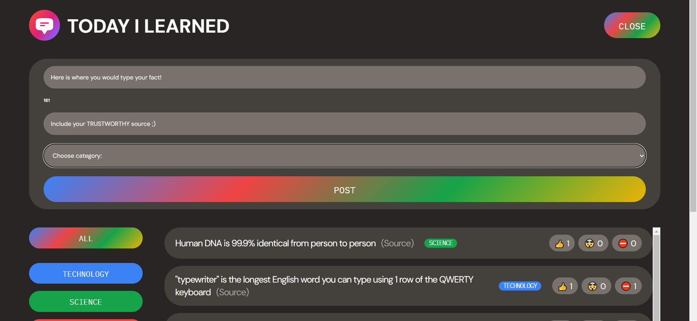
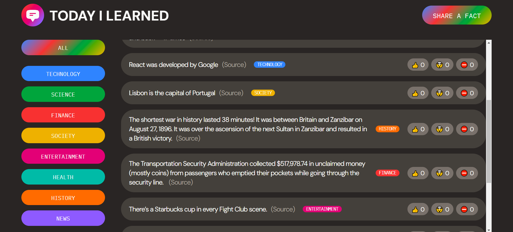
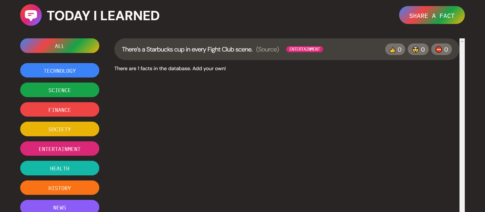

    
    <h1>Today I Learned</h1> 

Today I Learned is a web application that allows you to learn, react to and add facts all in one place!

<h2>Website Interface 	&#127747</h2>
Add a Fact:

Default Website Screenshot:

Filter Facts by Category:

<h2>Tech Stack &#128218</h2>
 Frontend

- HTML/CSS
- JavaScript
- React

#### Backend
- Node.js (Node.js must be downloaded in order to use React)
- Supabase

<h2>Need Help?	&#128587</h2>

Get your questions answered. Get in touch with me through [my website](https://briannaiwu.com) or [LinkedIn](https://www.linkedin.com/in/brinikki/)!

<h2>Learn More 💭</h2>

You can learn more in the [Create React App documentation](https://facebook.github.io/create-react-app/docs/getting-started).

This project was bootstrapped with [Create React App](https://github.com/facebook/create-react-app).

To learn React, check out the [React documentation](https://reactjs.org/).

###
